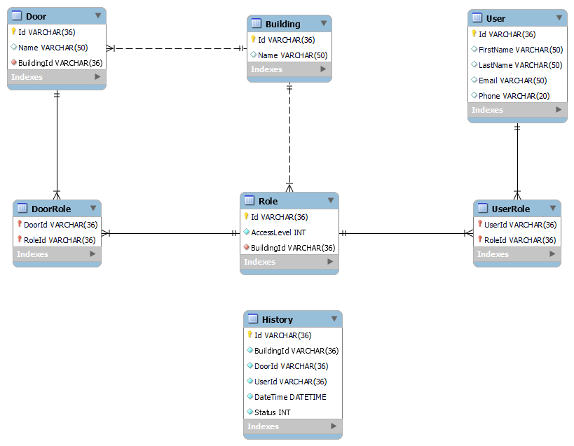
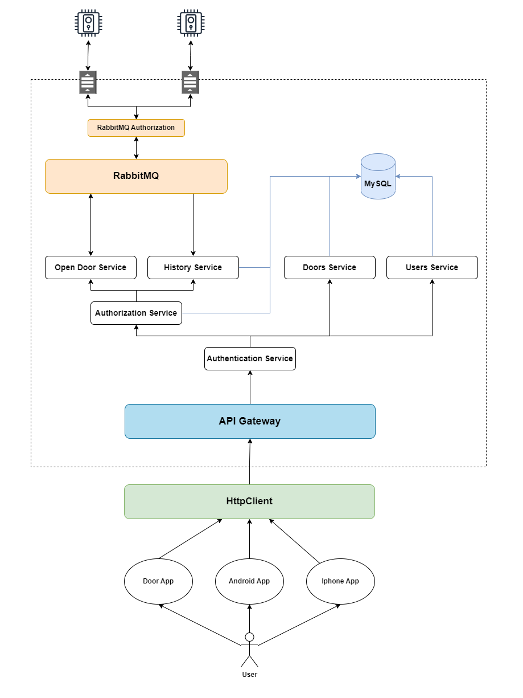

# DoorLock

## Database 

## Design Stage

## Implementation

Based on the assignment description, the implementation is a `RESTful integration API` that can be connected to mobile and other apps based on `HTTP URL Connection`. It is built as a decoupled monolith that can be seperated to `Microservices`.

### Open Door Workflow

To open a door, a post request is sent to the `DoorService`, where the user is authorized and an event is sent to the `Door` to  open, the result of this operation is registered on the `History` table. 

The `Doors` will communicate with the API through events. An `Open Door Command` will be sent with a `DoorIdentifier` in the `token`, the `Door` will answer with its `token` and `ActionResult`. 
Respectively a domain event will be sent to the `History Service` to register the result of this action in the database. 

A concern about this implementation is the Doors communicate direcly with RabbitMQ using `AMQP`, which might not be ideal for `IoT` devices an alternative would be to use a `RabbitMq` plugin that would allow the Door Devices to connect using `MQTT`  or even `MQTT` over websockets. `MQTT` also provides features like `heartbit` and `last-will-and-testament` useful to handle bad network conditions.

### History Workflow

History will support `Create` and `Get`calls. The implementation is based on how logs work. When an event is received by the service, a registration is added to the Database, recording who tried to open a door, where, which door and the result of this action. When a user tries to read the history, a get request is sent with various parameters (`BuildingId`, `DoorId`, `UserId`, etc) and if the user is authorised to access this table, a list of entries is returned. 

This workflow could be implemented in a seperate API and additionally, more effective technologies for reading and writing big amounts of data could be explored. A good idea would be to have a default implementation for `pagination` with default sorting based on the `CreationDateTime`.

### Authentication and Authorization

A user is authenticated with a `token` based on his `credentials` and that token is forwarded with the request to the API. The user is authorized based on his `token` and the `Roles` he has. For this, `Authorization policies` can be used on the `Controller`'s level.

`RBAC` is used for authorization and its implementation can be found under the `Roles Service`. (History should also be implemented based on `RBAC`)

### Additional Workflows

Correspondigly, there are workflows to:
- CRUD Users
- CRUD Roles
- CRUD Doors and Buildings

### Microservice Architecture (To be implemented)
The main idea was a microservice architecture where:
- Authorization and Authentication
- History
- Users 
- Buildings and Doors
- Roles
could be isolated microservices.

### Door Emulator

A basic CLI app was implemented to emulate the doors. It listens to a specific queue based on the `DoorId`.

### Database

The database is created in a `Docker container` using a `MySQL` script for initialization as I used a `Database First` approach.

Alternative: `Code First Approach` by creating the database using dotnet migration based on the register models. 

### Exceptions

Only a few exceptions are implemented. However, excpetions for `Bad Requests`, `Not Found`, `Unauthorised User` should be implemented and put in the correspoding workflows.

### Tests

The tests implemented are just a sample, since I didn't have enough time to do a full implementation.
Ideally, there would be unit tests for every method implemented, integration tests for services and the backend calls and acceptance tests for full end-to-end testing. 

For integration and acceptance tests, a temporary database would be created in a docker-container and seeders would be implemented for data for the individual cases/scenarios.

Acceptance test cases:
- Open Door as an authorized user
- Open Door as an unauthorized user
- Read History as an authorized user
- Read History as an unauthorized user
- Cases for CRUD operations for the rest of the entities. 

## Resources used

- [MassTransit.RabbitMQ](https://masstransit-project.com/usage/transports/rabbitmq.html)
- [RabbitMQ](https://www.rabbitmq.com/documentation.html)
- [Docker](https://www.docker.com/)
- [MySQL](https://www.mysql.com/)
